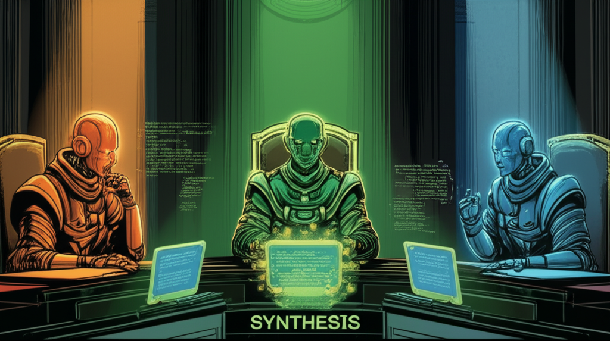

# The LLM Council

```
$ council run architect "Design a mass hallucination prevention system"

                    ╔══════════════════════════════════════════════════════════╗
                    ║             ⚖️  THE LLM COUNCIL CONVENES  ⚖️              ║
                    ╚══════════════════════════════════════════════════════════╝

      ┌─────────────────┐      ┌─────────────────┐      ┌─────────────────┐
      │  ┌───────────┐  │      │  ┌───────────┐  │      │  ┌───────────┐  │
      │  │ ╭───────╮ │  │      │  │ ╭───────╮ │  │      │  │ ╭───────╮ │  │
      │  │ │GPT5.2│ │  │      │  │ │ CLAUDE│ │  │      │  │ │GEMINI │ │  │
      │  │ ╰───────╯ │  │      │  │ ╰───────╯ │  │      │  │ ╰───────╯ │  │
      │  │   ◉ ◉     │  │      │  │   ◉ ◉     │  │      │  │   ◉ ◉     │  │
      │  │    ⌣      │  │      │  │    ▽      │  │      │  │    ○      │  │
      │  └───────────┘  │      │  └───────────┘  │      │  └───────────┘  │
      │    JUDGE #1     │      │    JUDGE #2     │      │    JUDGE #3     │
      └────────┬────────┘      └────────┬────────┘      └────────┬────────┘
               │                        │                        │
               │ "I propose we use      │ "Actually, I must      │ "Interesting, but
               │  a vector database..." │  respectfully disagree" │  what about...?"
               │                        │                        │
               └────────────────────────┼────────────────────────┘
                                        ▼
                         ┌──────────────────────────────┐
                         │     🔥 ADVERSARIAL DEBATE 🔥   │
                         │                              │
                         │  GPT5.2: "Your approach has  │
                         │          a cold start issue" │
                         │                              │
                         │  CLAUDE: "Fair, but yours    │
                         │          doesn't scale"      │
                         │                              │
                         │  GEMINI: "Both valid. What   │
                         │          if we combine..."   │
                         └──────────────┬───────────────┘
                                        ▼
                         ┌──────────────────────────────┐
                         │      ✅ VERDICT REACHED ✅     │
                         │                              │
                         │   Synthesized best ideas     │
                         │   Schema-validated output    │
                         │   Confidence: 94%            │
                         └──────────────────────────────┘

[Council] Task completed in 45.2s | 3 judges | 2 debate rounds | Cost: $0.12
```

<p align="center">
  
</p>

[](https://opensource.org/licenses/MIT)
[](https://www.python.org/downloads/)
[](https://github.com/sherifkozman/the-llm-council)
[](https://github.com/astral-sh/ruff)
[](https://mypy-lang.org/)

A Multi-LLM Council Framework that orchestrates multiple LLM backends to enable **adversarial debate**, **cross-validation**, and **structured decision-making**.

## Why Use a Council?

Single-model outputs have blind spots. By running multiple models in parallel and having them critique each other, the council:

- **Catches errors** that any single model might miss
- **Reduces hallucination** through cross-validation
- **Produces higher-quality outputs** via adversarial refinement
- **Validates structure** with JSON schema enforcement and retry logic

## Features

| Feature | Description |
|---------|-------------|
| **Multi-Model Council** | Run Claude, GPT-4, and Gemini in parallel via single OpenRouter key |
| **Adversarial Critique** | Built-in critique phase identifies weaknesses and blind spots |
| **Schema Validation** | JSON schema validation with automatic retry for structured outputs |
| **Provider Agnostic** | Swap between OpenRouter, direct APIs, or CLI-based providers |
| **Health Checks** | Preflight provider health checks with latency tracking |
| **Graceful Degradation** | Automatic retry, fallback, and skip strategies for failures |
| **Artifact Store** | Persistent storage of drafts with tiered summarization |
| **Secret-Safe Logging** | Redaction pipeline prevents credential leakage |

## Requirements

| Requirement | Details |
|-------------|---------|
| **Python** | 3.10, 3.11, or 3.12 |
| **OS** | macOS, Linux, Windows (native or WSL) |
| **API Key** | At least one provider key (see below) |

### Supported Providers

| Provider | Environment Variable | Notes |
|----------|---------------------|-------|
| OpenRouter | `OPENROUTER_API_KEY` | **Recommended** - single key for all models |
| OpenAI | `OPENAI_API_KEY` | Direct GPT access |
| Anthropic | `ANTHROPIC_API_KEY` | Direct Claude access |
| Google | `GOOGLE_API_KEY` or `GEMINI_API_KEY` | Direct Gemini access |
| Vertex AI | `GOOGLE_CLOUD_PROJECT` or `ANTHROPIC_VERTEX_PROJECT_ID` + ADC | Enterprise GCP - Gemini + Claude |

## Installation

```bash
pip install the-llm-council
```

With specific providers:

```bash
# OpenRouter (recommended - single API key for all models)
pip install the-llm-council

# Direct APIs
pip install the-llm-council[anthropic,openai,google]

# Vertex AI (Enterprise GCP)
pip install the-llm-council[vertex]

# All providers
pip install the-llm-council[all]

# Development
pip install the-llm-council[dev]
```

## Agent Skills (Claude Code, OpenAI Codex, Cursor, etc.)

The LLM Council is available as an **Agent Skill** following the open [Agent Skills](https://agentskills.io) standard. This works across Claude Code, OpenAI Codex, Cursor, VS Code, and other skill-compatible agents.

### Claude Code

```bash
# Step 1: Add the repo as a marketplace
/plugin marketplace add sherifkozman/the-llm-council

# Step 2: Install the plugin
/plugin install llm-council@the-llm-council
```

Once installed, the `council` skill is auto-invoked when relevant, or use the `/council` command:

```
/council implementer "Build a login page with OAuth"
```

### OpenAI Codex

```bash
# Copy skills directory to Codex skills location
cp -r skills/council ~/.codex/skills/
```

### Other Agents (Cursor, VS Code, GitHub, etc.)

Copy the `skills/council/` directory to your agent's skills folder. The skill follows the open Agent Skills spec and works with any compatible agent.

## Quick Start

### CLI Usage

```bash
# Set your API key
export OPENROUTER_API_KEY="your-key"

# Run a council task (v0.5.0 syntax with modes)
council run drafter --mode impl "Build a login page with OAuth"

# Multi-model council (Claude + GPT-5 + Gemini debating)
council run drafter --mode arch "Design a caching layer" \
  --models "anthropic/claude-opus-4-5,openai/gpt-5.1,google/gemini-3-flash-preview"

# Or set via environment variable
export COUNCIL_MODELS="anthropic/claude-opus-4-5,openai/gpt-5.1,google/gemini-3-flash-preview"
council run drafter "Build a login page"

# Code review with security analysis
council run critic --mode review "Review auth changes" --verbose

# Disable artifact storage for faster runs
council run drafter "Quick fix" --no-artifacts

# Get structured JSON output
council run planner "Add user authentication" --json

# Legacy syntax still works (shows deprecation warning)
council run implementer "Build a login page"  # → drafter --mode impl
```

### Python API

```python
from llm_council import Council
from llm_council.protocol.types import CouncilConfig

# With mode configuration
config = CouncilConfig(providers=["openrouter"], mode="impl")
council = Council(config=config)
result = await council.run(
    task="Build a login page with OAuth",
    subagent="drafter"
)
print(result.output)
```

### Check Provider Health

```bash
council doctor
```

## Architecture

```
┌─────────────────────────────────────────────────────────────────────┐
│                           LLM Council                               │
├─────────────────────────────────────────────────────────────────────┤
│                                                                     │
│  ┌─────────────┐    ┌─────────────┐    ┌─────────────────────────┐ │
│  │    CLI      │───▶│  Council    │───▶│     Orchestrator        │ │
│  │  (typer)    │    │   (API)     │    │                         │ │
│  └─────────────┘    └─────────────┘    │  ┌───────────────────┐  │ │
│                                        │  │  Health Checker   │  │ │
│  ┌─────────────────────────────────┐   │  ├───────────────────┤  │ │
│  │        Provider Registry        │◀──│  │ Degradation Policy│  │ │
│  │  ┌─────────┐ ┌─────────┐       │   │  ├───────────────────┤  │ │
│  │  │OpenRouter│ │Anthropic│ ...  │   │  │  Artifact Store   │  │ │
│  │  └─────────┘ └─────────┘       │   │  └───────────────────┘  │ │
│  └─────────────────────────────────┘   └─────────────────────────┘ │
│                                                                     │
│  ┌─────────────────────────────────────────────────────────────┐   │
│  │                    Subagent Configs                          │   │
│  │  router | planner | architect | implementer | reviewer | ... │   │
│  └─────────────────────────────────────────────────────────────┘   │
│                                                                     │
│  ┌─────────────────────────────────────────────────────────────┐   │
│  │                     JSON Schemas                             │   │
│  │  Validation & retry logic for structured outputs             │   │
│  └─────────────────────────────────────────────────────────────┘   │
│                                                                     │
└─────────────────────────────────────────────────────────────────────┘
```

### Pipeline Flow

```
0. HEALTH CHECK (optional)
   └── Preflight check of all providers, skip unhealthy ones

1. PARALLEL DRAFTS
   ├── Provider A generates draft
   ├── Provider B generates draft
   └── Provider C generates draft
   └── (Graceful degradation on failures)

2. ADVERSARIAL CRITIQUE
   └── Critic identifies weaknesses, contradictions, blind spots

3. SYNTHESIS
   └── Merge best elements, address critique, validate schema

4. VALIDATION
   └── JSON schema check with retry on failure

5. ARTIFACT STORAGE (optional)
   └── Store drafts and outputs for context management
```

## Subagents (v0.5.0)

### Core Agents

| Subagent | Modes | Purpose | Example |
|----------|-------|---------|---------|
| `drafter` | `impl`, `arch`, `test` | Generate code, designs, tests | "Build the login page" |
| `critic` | `review`, `security` | Review and analyze | "Review this PR for security" |
| `synthesizer` | - | Merge and finalize | "Generate changelog for v1.2" |
| `researcher` | - | Technical research | "Research OAuth providers" |
| `planner` | `plan`, `assess` | Roadmaps and decisions | "Plan the auth implementation" |
| `router` | - | Classify and route tasks | "Is this a bug or feature?" |

### Agent Modes

```bash
# drafter modes
council run drafter --mode impl "Build login page"     # Implementation (default)
council run drafter --mode arch "Design caching layer" # Architecture
council run drafter --mode test "Design test suite"    # Test design

# critic modes
council run critic --mode review "Review PR"           # Code review (default)
council run critic --mode security "Analyze auth"      # Security analysis

# planner modes
council run planner --mode plan "Plan implementation"  # Planning (default)
council run planner --mode assess "Redis vs Memcached" # Build vs buy
```

### Deprecated Aliases (Backwards Compatible)

The following legacy names still work but show a deprecation warning:

| Old Name | Use Instead | Removed In |
|----------|-------------|------------|
| `implementer` | `drafter --mode impl` | v1.0 |
| `architect` | `drafter --mode arch` | v1.0 |
| `test-designer` | `drafter --mode test` | v1.0 |
| `reviewer` | `critic --mode review` | v1.0 |
| `red-team` | `critic --mode security` | v1.0 |
| `assessor` | `planner --mode assess` | v1.0 |
| `shipper` | `synthesizer` | v1.0 |

## Writing a Provider

Providers are pluggable via Python entry points. See the full [Provider Development Guide](docs/providers/creating-providers.md) for detailed instructions.

### Quick Example

```python
from llm_council.providers.base import ProviderAdapter, GenerateRequest, GenerateResponse

class MyProvider(ProviderAdapter):
    name = "myprovider"

    async def generate(self, request: GenerateRequest) -> GenerateResponse:
        # Your implementation
        return GenerateResponse(text="...", content="...")

    async def doctor(self) -> DoctorResult:
        return DoctorResult(ok=True, message="Healthy")
```

Register via `pyproject.toml`:

```toml
[project.entry-points."llm_council.providers"]
myprovider = "my_package.providers:MyProvider"
```

### Reference Implementations

| Provider | Type | File |
|----------|------|------|
| OpenRouter | HTTP API | `src/llm_council/providers/openrouter.py` |
| Anthropic | Native SDK | `src/llm_council/providers/anthropic.py` |
| OpenAI | Native SDK | `src/llm_council/providers/openai.py` |
| Google | Native SDK | `src/llm_council/providers/google.py` |
| Vertex AI | Native SDK | `src/llm_council/providers/vertex.py` |
| Codex CLI | Subprocess | `src/llm_council/providers/cli/codex.py` |

## Configuration

### Environment Variables

```bash
# OpenRouter (recommended - single key for all models)
export OPENROUTER_API_KEY="your-key"

# Direct APIs
export ANTHROPIC_API_KEY="sk-ant-..."
export OPENAI_API_KEY="sk-..."
export GOOGLE_API_KEY="..."

# Vertex AI - Gemini (Enterprise GCP)
export GOOGLE_CLOUD_PROJECT="your-project-id"
export GOOGLE_CLOUD_LOCATION="us-central1"  # optional
export VERTEX_AI_MODEL="gemini-2.5-pro"     # optional, default: gemini-2.0-flash

# Vertex AI - Claude (Enterprise GCP)
export ANTHROPIC_VERTEX_PROJECT_ID="your-project-id"
export CLOUD_ML_REGION="global"              # Claude uses global region
export ANTHROPIC_MODEL="claude-opus-4-5@20251101"  # model with version

# Auth for Vertex AI: gcloud auth application-default login OR
# export GOOGLE_APPLICATION_CREDENTIALS="/path/to/sa.json"

# Multi-model council: comma-separated OpenRouter model IDs
export COUNCIL_MODELS="anthropic/claude-opus-4-5,openai/gpt-5.1,google/gemini-3-flash-preview"

# Optional: Model pack overrides for specific task types
export COUNCIL_MODEL_FAST="anthropic/claude-3-5-haiku"    # Quick tasks
export COUNCIL_MODEL_REASONING="anthropic/claude-opus-4-5" # Deep analysis
export COUNCIL_MODEL_CODE="openai/gpt-5.1"                # Code generation
export COUNCIL_MODEL_CRITIC="anthropic/claude-sonnet-4-5" # Adversarial critique
```

### Per-Subagent Reasoning Configuration (v0.3.0+)

Subagents can be configured with provider preferences, model overrides, and extended reasoning/thinking budgets in their YAML configs:

```yaml
# src/llm_council/subagents/red-team.yaml
name: red-team
model_pack: harsh_critic

# Provider preferences
providers:
  preferred: [anthropic, openai]
  fallback: [openrouter]
  exclude: [google]

# Model overrides per provider
models:
  anthropic: claude-opus-4-5
  openai: o3-mini
  google: gemini-3-pro

# Extended reasoning/thinking configuration
reasoning:
  enabled: true
  effort: high           # OpenAI o-series: low/medium/high
  budget_tokens: 32768   # Anthropic: 1024-128000
  thinking_level: high   # Google Gemini 3.x: minimal/low/medium/high
```

| Provider | Parameter | Values | Description |
|----------|-----------|--------|-------------|
| OpenAI | `effort` | low/medium/high | Reasoning effort for o-series models |
| Anthropic | `budget_tokens` | 1024-128000 | Extended thinking token budget |
| Google | `thinking_level` | minimal/low/medium/high | Gemini 3.x thinking level |

#### Default Reasoning Tiers (v0.4.0+)

All subagents have pre-configured reasoning defaults based on task complexity:

| Tier | Subagents | Config | Use Case |
|------|-----------|--------|----------|
| **High** | architect, assessor, planner, reviewer, red-team | `effort: high`, `budget_tokens: 16384` | Deep analysis, critical decisions |
| **Medium** | implementer, researcher | `effort: medium`, `budget_tokens: 8192` | Balanced code/research tasks |
| **Disabled** | router, shipper, test-designer | `enabled: false` | Fast tasks, no overhead |

### Config File

```yaml
# ~/.config/llm-council/config.yaml
providers:
  - name: openrouter
    api_key: ${OPENROUTER_API_KEY}
    default_model: anthropic/claude-opus-4-5

defaults:
  timeout: 120
  max_retries: 3
  summary_tier: actions
```

## CLI Reference

```bash
council run <subagent> "<task>"    # Run a council task
council doctor                      # Check provider health
council config                      # Show configuration

# Options
--mode             Agent mode (impl/arch/test for drafter, review/security for critic, etc.)
--providers, -p    Comma-separated provider list
--models, -m       Comma-separated OpenRouter model IDs for multi-model council
--no-artifacts     Disable artifact storage
--json             Output structured JSON
--verbose, -v      Verbose output

# Config file options (moved from CLI in v0.5.0)
# Set these in ~/.config/llm-council/config.yaml under 'defaults:'
#   timeout: 120
#   max_retries: 3
#   enable_degradation: true
```

## Development

```bash
# Clone the repository
git clone https://github.com/sherifkozman/the-llm-council.git
cd the-llm-council

# Install with dev dependencies
pip install -e ".[dev]"

# Run tests
pytest

# Run linting
ruff check src/
mypy src/llm_council
```

## Contributing

Contributions are welcome! See our [Roadmap](ROADMAP.md) for planned features and [Contributing Guide](CONTRIBUTING.md) for details.

### Quick Start

```bash
# Fork and clone
git clone https://github.com/YOUR_USERNAME/the-llm-council.git
cd the-llm-council

# Install dev dependencies
pip install -e ".[dev]"

# Run tests
pytest

# Run linting
ruff check src/ && mypy src/llm_council
```

### Contribution Workflow

1. **Fork** the repository
2. **Create** a feature branch (`git checkout -b feature/amazing-feature`)
3. **Make** your changes
4. **Test** your changes (`pytest`)
5. **Lint** your code (`ruff check src/ && mypy src/llm_council`)
6. **Commit** with a clear message (`git commit -m 'Add amazing feature'`)
7. **Push** to your branch (`git push origin feature/amazing-feature`)
8. **Open** a Pull Request

### What We're Looking For

- **New Providers**: Add support for more LLM backends
- **New Subagents**: Create specialized agents for specific tasks
- **Bug Fixes**: Found a bug? We'd love a fix!
- **Documentation**: Improvements to docs are always welcome
- **Tests**: More test coverage is great

## Security

For security concerns, please see our [Security Policy](SECURITY.md) or email vibecode@sherifkozman.com.

**Key security features:**
- CLI adapters use exec-style subprocess (no shell injection)
- Environment variable allowlisting prevents secret leakage
- Path traversal protection in artifact storage
- Configurable secret redaction in logs

## License

MIT License - see [LICENSE](LICENSE) for details.

## Acknowledgments

Built with:
- [Pydantic](https://docs.pydantic.dev/) - Data validation
- [Typer](https://typer.tiangolo.com/) - CLI framework
- [Rich](https://rich.readthedocs.io/) - Terminal formatting
- [httpx](https://www.python-httpx.org/) - Async HTTP client

---

<p align="center">
  <i>When one model isn't enough, convene a council.</i>
</p>

<p align="center">
  <sub>~ vibe coded by <a href="https://twitter.com/sherifkozman">Sherif Kozman</a> & The LLM Council ~</sub>
</p>
